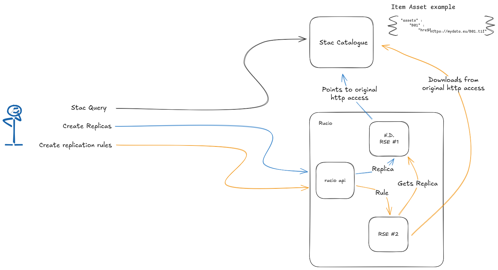

# stac-rucio
A python package for managing STAC asset locality amongst a list of Rucio Storage Elements.

The package is intended to work by consuming the results of queries made against a stac catalogue. For a given stac search, 
a list of items are returned, for this list of items, the stac_rucio package supports creating replicas, 
and creating replication rules.

The stac_rucio package additionally comes with a modifier function to be used with the pystac_client,
the modifier will check rucio for any existing replicas across the available RSEs, available replicas will
be listed within an asset using the alternate assets stac extension. 

## Installation

PyPI support coming.

## Example

A notebook example is available [here](./examples/demo_example.ipynb).

In the image below, we'll consinder a stac item which has no replicas or rules in rucio, but our
user wants to bring the data into RSE #2. For this to work, we require a Non-Deterministic
RSE ( ND-RSE ) to be configured amongst the available RSEs. A ND-RSE is a storage element in Rucio with no
physical storage attached. This storage element is a pragmatic solution for "registering" data in Rucio where
that data remains located at external http endpoints. Data will only be replicated in this example, when 
the user creates a replication rule to get data from RSE #1 to RSE #2 ( but this data never actually resides at
RSE #1 ). 

To register the data for B01, our user needs to create a replica in the ND-RSE for this item if it does not
already exist. For STAC collections supported by a Rucio server in this way, it would be best to create these replicas
ahead of time, as they will always be required, and will always be registered at the same ND-RSE. When replicas are created,
the file size needs to be provided in bytes, as well as the adler32 checksum.

When the replica exists, the user needs to create a replication rule. The replication rule will instruct Rucio to copy
data from RSE #1 to RSE #2. As the data does not actually exist at RSE #1, it will be downloaded from the original http
endpoint exposed by the stac catalogue.
